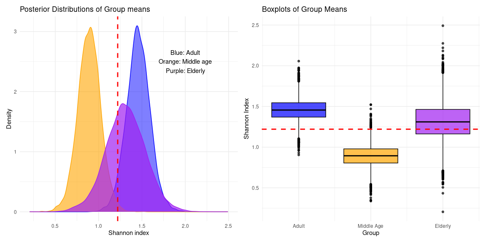

# Probabilistic multi-group comparison of alpha diversity
Rasmus Hindström
2025-07-24

- [0. Summary](#0-summary)
- [1. Data preparation](#1-data-preparation)
- [2. Model fitting](#2-model-fitting)
- [3. Classical approach](#3-classical-approach)
- [4. Conclusions](#4-conclusions)

# 0. Summary

This report demonstrates the use and interpretation of a probabilisitc
alternative to multi-group comparisons of alpha diversity. The basis is
a multi-level model with a group-level effect, which is estimated using
Bayesian estimation with the `brms` package.

# 1. Data preparation

Preparing data from the `mia` package.

``` r
library(mia)
library(dplyr)
library(brms)
library(bayesplot)
```

``` r
data("peerj13075", package = "mia")
tse <- peerj13075
tse <- addAlpha(
    tse,
    assay.type = "counts",
    index = "shannon"
)
df <- as.data.frame(colData(tse))
```

# 2. Model fitting

The model is fitted using the `brm` function from the `brms` package.
Reponse variable is the Shannon index, and the grouping variable is the
3 classes of `age`; `Adult`, `Middle_age`, and `Elderly`.

Model definition is as follows:

$$
y_{ik} \sim \text{t}(\nu, \mu_{ik}, \sigma_k)
$$

$$
\mu_{ik} = \beta_0 + \beta_k
$$

$$
\sigma_k = \gamma + \gamma_k
$$

*Default priors used by `brm()`*

$$
\nu \sim \gamma(2, 0.1)
$$ $$
\beta_0 \sim \text{t}(3, 1.3, 2.5)
$$ $$
\beta_k, \sigma \sim \text{t}(3, 0, 2.5)
$$

``` r
# Model with partial pooling
fit <- brm(
    formula = bf(
        shannon ~ 1 +(1|Age),
        sigma ~ 1 + (1|Age)
    ),
    data = df,
    family = student(),
    iter = 8000,
    chains = 6,
    cores = 6
) 
```

    Warning: Parts of the model have not converged (some Rhats are > 1.05). Be
    careful when analysing the results! We recommend running more iterations and/or
    setting stronger priors.

    Warning: There were 763 divergent transitions after warmup. Increasing
    adapt_delta above 0.8 may help. See
    http://mc-stan.org/misc/warnings.html#divergent-transitions-after-warmup

     Family: student 
      Links: mu = identity; sigma = log; nu = identity 
    Formula: shannon ~ 1 + (1 | Age) 
             sigma ~ 1 + (1 | Age)
       Data: df (Number of observations: 58) 
      Draws: 6 chains, each with iter = 8000; warmup = 4000; thin = 1;
             total post-warmup draws = 24000

    Multilevel Hyperparameters:
    ~Age (Number of levels: 3) 
                        Estimate Est.Error l-95% CI u-95% CI Rhat Bulk_ESS Tail_ESS
    sd(Intercept)           0.73      0.67     0.08     2.63 1.03      261      158
    sd(sigma_Intercept)     0.54      0.53     0.03     2.09 1.01     1481     1298

    Regression Coefficients:
                    Estimate Est.Error l-95% CI u-95% CI Rhat Bulk_ESS Tail_ESS
    Intercept           1.21      0.63    -0.60     2.97 1.06      108       37
    sigma_Intercept    -0.41      0.38    -1.22     0.47 1.01     1829     1085

    Further Distributional Parameters:
       Estimate Est.Error l-95% CI u-95% CI Rhat Bulk_ESS Tail_ESS
    nu    23.52     14.05     5.78    58.82 1.00     2964     9993

    Draws were sampled using sampling(NUTS). For each parameter, Bulk_ESS
    and Tail_ESS are effective sample size measures, and Rhat is the potential
    scale reduction factor on split chains (at convergence, Rhat = 1).

    $Age
    , , Intercept

                Estimate Est.Error      Q2.5    Q97.5
    Adult      1.4213551 0.1425302 1.1387549 1.695379
    Elderly    1.2928381 0.1948622 0.9211176 1.691304
    Middle_age 0.9422978 0.1515308 0.6514824 1.254537

    , , sigma_Intercept

                 Estimate Est.Error       Q2.5      Q97.5
    Adult      -0.4323398 0.1579523 -0.7366740 -0.1198411
    Elderly    -0.1994206 0.1805728 -0.5266161  0.1814123
    Middle_age -0.6186283 0.2031259 -1.0050134 -0.2308628

<details class="code-fold">
<summary>Posterior plotting</summary>

``` r
library(ggplot2)
library(patchwork)

draws <- as_draws_df(fit)
plot_data <- data.frame(
    population = draws$b_Intercept,
    pop_mean = mean(draws$b_Intercept),
    adult = draws$b_Intercept + draws$'r_Age[Adult,Intercept]',
    elderly = draws$b_Intercept + draws$'r_Age[Elderly,Intercept]',
    middle_age = draws$b_Intercept + draws$'r_Age[Middle_age,Intercept]'
)

p1 <- ggplot(data = plot_data) +
    geom_density(aes(x = adult), fill = "blue", alpha = 0.5, color = "blue") +
    geom_density(aes(x = elderly), fill = "purple", alpha = 0.6, color = "purple") +
    geom_density(aes(x = middle_age), fill = "orange", alpha = 0.7, color = "orange") +
    geom_vline(xintercept = plot_data$pop_mean, linetype = "dashed", color = "red", linewidth = 1) +
    labs(
        title = "Posterior Distributions of Group means",
        x = "Shannon index",
        y = "Density"
    ) +
    annotate(
        "text", x = 2, y = 2.5,
        label = "Orange: Middle Aged\nPurple: Elderly\nBlue: Adult",
    ) +
    theme_minimal()

p2 <- ggplot(data = plot_data) +
    geom_boxplot(aes(y = adult, x = 1), fill = "blue", alpha = 0.7, color = "black") +
    geom_boxplot(aes(y = elderly, x = 2), fill = "purple", alpha = 0.7, color = "black") +
    geom_boxplot(aes(y = middle_age, x = 3), fill = "orange", alpha = 0.7, color = "black") +
    geom_hline(yintercept = plot_data$pop_mean, linetype = "dashed", color = "red", linewidth = 1) +
    scale_x_continuous(
        breaks = c(1, 2, 3),
        labels = c("Adult", "Elderly", "Middle Age")
    ) +
    labs(
        title = "Boxplots of Group Means",
        x = "Group",
        y = "Shannon Index"
    ) +
    theme_minimal()

p1 + p2
```

</details>



From the plots we can infer groups are not similar. Particularly the
Middle aged (Orange) group appears to have a lower Shannon index. The
boxplots paint a clear picture of the higher overlap between the Adult
and Edlerly group, while the Middle aged group differs. In both plots
the red dashed line indicates the total population posterior mean.

# 3. Classical approach

With classical methods multi group comparisons are often done in
multiple steps.

``` r
kruskal.test(shannon ~ Age, df)
```


        Kruskal-Wallis rank sum test

    data:  shannon by Age
    Kruskal-Wallis chi-squared = 7.7239, df = 2, p-value = 0.02103

We get a p-value \< 0.05, so there are ‘significant’ differences within
the groups.

``` r
pairwise.wilcox.test(df$shannon, df$Age, p.adjust = "fdr")
```


        Pairwise comparisons using Wilcoxon rank sum exact test 

    data:  df$shannon and df$Age 

               Adult  Elderly
    Elderly    0.7154 -      
    Middle_age 0.0056 0.1887 

    P value adjustment method: fdr 

Post-hoc testing requires adjusting the p-values. Here we observe that
the groups `Middle_age` and `Adult` have a significant difference. Other
pairwise comparisons are not significant.

# 4. Conclusions

Both the probabilistic and classical approach to multigroup testing
gives the same result. The middle age group is signaled out. Contrasting
the two methods, it is clear that the probabilistic approach gives a
richer inference, with the added benefit of intuitive interpretation.

Note: there are some warnings from the sampler of the probabilistic
model, but Rhats are close to 1 and ESS are not too low, if we disregard
the estimates for the sigma term. Some tweaks to the model definition
might be required to get cleaner sampling.
